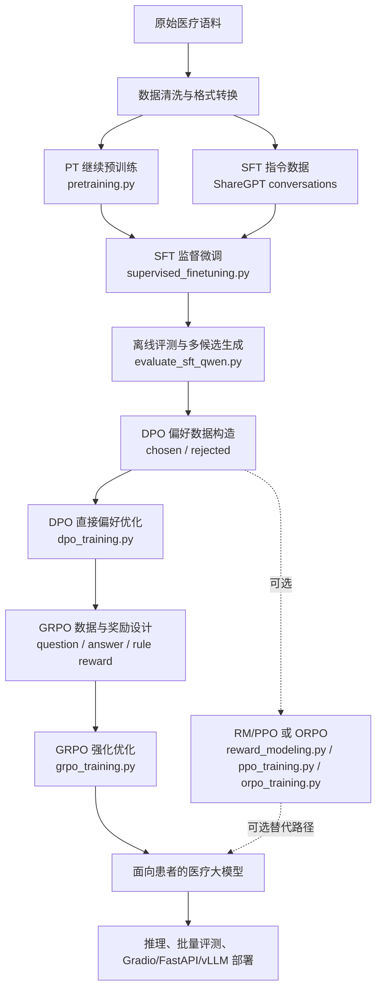

## Introduction

**Medical_Qwen** 是基于 Qwen 系列模型搭建的中文医疗大模型训练与评测工程。项目覆盖从领域继续预训练、监督微调、偏好优化到强化学习式训练的完整流程，并补充了适配中文医疗问答的自动评测脚本，用于计算 BLEU-1/2/3/4、ROUGE-L、METEOR、BERTScore 等指标。

当前目录重点支持：

- 面向医疗语料的 PT（Continue Pretraining）与 SFT（Supervised Fine-tuning）。
- 基于 chosen/rejected 偏好对的 DPO、RM、PPO、ORPO 训练。
- 基于 TRL `GRPOTrainer` 的 GRPO 训练，支持 QLoRA、4bit 加载和长上下文配置。
- SFT、PT、DPO checkpoint 的离线评测与指标保存。
- Gradio、FastAPI、普通推理、多卡推理和 vLLM 部署示例。

## News
- 新增医疗报告生成和纯问答数据集的数据处理：包括将英文的报告翻译为中文、去除问答中低质量的重复片段、去掉和问答无意义的词语和语句、进行问答的高质量该写：https://github.com/scuterGuoyulong/Medical_fullstack
- 新增多模态统一训练的框架训练
## Features

- **医疗领域适配**：支持在医疗百科、医疗问答、ShareGPT 格式对话数据上继续预训练和指令微调，使基础 Qwen 模型更贴合医疗问答语料分布。
- **多阶段训练入口**：提供 `pretraining.py`、`supervised_finetuning.py`、`dpo_training.py`、`reward_modeling.py`、`ppo_training.py`、`orpo_training.py`、`grpo_training.py` 等训练脚本，并配套 `run_*.sh` 启动脚本。
- **全参、LoRA、QLoRA 支持**：SFT、DPO、GRPO 等阶段均包含 PEFT/LoRA 相关参数，GRPO 示例脚本中还给出了 4bit QLoRA 长文本训练配置。
- **中文生成指标评测**：`evaluate_sft_qwen.py` 默认按中文逐字切分计算 BLEU/ROUGE，并支持 METEOR、BERTScore；评测结果会保存为 `metrics.json` 和生成样例。
- **偏好学习链路**：DPO/RM/ORPO 使用 `question + response_chosen + response_rejected` 偏好数据，便于把模型生成结果、人工标注结果或规则筛选结果构造成偏好对。
- **推理与服务化**：提供 `inference.py`、`inference_multigpu_demo.py`、`gradio_demo.py`、`fastapi_server_demo.py`、`vllm_deployment.sh`，方便训练后快速验证和部署。
- **RAG 示例**：`chatpdf.py` 提供基于知识库文件的 LLM 问答示例，可作为后续医疗知识检索增强的基础。

## Training Pipeline



| Stage | 作用 | Python 脚本 | Shell 示例 |
|:--|:--|:--|:--|
| PT | 医疗领域继续预训练 | `pretraining.py` | `run_pt.sh`, `run_pt_incremental_deepspeed.sh` |
| SFT | 指令微调与医疗问答对齐 | `supervised_finetuning.py` | `run_sft.sh`, `run_sft_fullft_auto2gpu.sh`, `run_sft_fullft_auto2gpu_deepspeed.sh` |
| Eval | 生成质量验证和指标计算 | `evaluate_sft_qwen.py`, `test_best_checkpoint_eval.py` | `run_test_checkpoint20800_medical_sft_1k_metrics.sh`, `run_test_medical_sft_1k_best.sh` |
| DPO | 在 SFT 模型基础上做直接偏好优化 | `dpo_training.py` | `run_dpo.sh` |
| GRPO | 在 DPO 模型基础上用可验证奖励继续优化 | `grpo_training.py` | `run_grpo.sh` |
| RM/PPO | 奖励模型与 RLHF | `reward_modeling.py`, `ppo_training.py` | `run_rm.sh`, `run_ppo.sh` |
| ORPO | 单阶段偏好优化 | `orpo_training.py` | `run_orpo.sh` |
| Inference | 交互、批量和服务化推理 | `inference.py`, `gradio_demo.py`, `fastapi_server_demo.py` | `inference.sh`, `vllm_deployment.sh` |

## Installation

在当前目录安装依赖：

```shell
pip install -r requirements.txt --upgrade
```

评测脚本额外依赖：

```shell
pip install nltk rouge-score bert-score
```

如果 BERTScore 模型无法直接从 Hugging Face 下载，可设置镜像：

```shell
export HF_ENDPOINT="https://hf-mirror.com"
```

## Dataset Format

更完整的数据说明见 `docs/datasets.md`。本项目常用格式如下。

### PT 数据

普通文本格式，每行一个文档：

```text
doc1
doc2
doc3
```

也支持 JSONL：

```json
{"text": "doc1"}
{"text": "doc2"}
{"text": "doc3"}
```

### SFT 数据

SFT 使用 ShareGPT 风格 `conversations`，每行一个样本：

```json
{
  "conversations": [
    {"from": "human", "value": "患者发热咳嗽应该注意什么？"},
    {"from": "gpt", "value": "建议关注体温、咳嗽持续时间、是否伴随胸闷气促等症状，并及时就医。"}
  ]
}
```

### DPO 数据集构造

DPO 训练要求把同一个问题下的更优回答和较差回答组织成偏好对。可以来自人工标注、医生审核、模型多候选采样后人工筛选，也可以来自规则过滤后的高低质量回答。

对于“面向患者的医疗大模型”，DPO 主要优化的是**回答偏好**：让模型在多个可行回答中更倾向于生成医学上更可靠、更安全、更适合患者理解的回答，而不是只追求更长或更像训练答案。它适合优化下列偏好：

- **医学准确性优先**：`chosen` 应基于指南、常识和医学事实回答，避免编造病因、药名、剂量或检查结论；`rejected` 可以是事实错误、过度确定或遗漏关键风险的回答。
- **安全分诊意识**：`chosen` 应能识别急危重症信号，例如胸痛、呼吸困难、意识障碍、大出血、高热不退等，并建议及时就医；`rejected` 是延误就医、轻率安慰或让患者自行处理高风险症状的回答。
- **不替代医生诊断**：`chosen` 应说明线上回答只能提供科普和就医建议，不能替代面诊、检查和医生处方；`rejected` 是直接下诊断、直接开处方或承诺疗效的回答。
- **患者可理解性**：`chosen` 应使用通俗、结构清晰的语言，解释可能原因、观察指标、就诊科室和下一步行动；`rejected` 是术语堆砌、表达含混或答非所问的回答。
- **同理心和安抚**：`chosen` 应对患者焦虑有基本回应，同时保持专业克制；`rejected` 是冷漠、恐吓、指责患者或制造焦虑的回答。
- **隐私与伦理**：`chosen` 不要求患者暴露无关隐私，不给出歧视性或不合规建议；`rejected` 是诱导泄露隐私或包含不当价值判断的回答。

构造 DPO 偏好对时，不建议把“回答越详细越好”作为唯一标准。面向患者的医疗助手更应该偏好“准确、安全、清楚、知道边界”的回答。

`dpo_training.py` 实际读取以下字段：

- `system`：可选，系统提示词；没有系统提示时可设为空字符串。
- `history`：可选，多轮历史，格式为 `[[question, answer], ...]`；单轮数据可设为空列表。
- `question`：当前用户问题。
- `response_chosen`：更偏好的回答，作为 DPO 的 chosen。
- `response_rejected`：较不偏好的回答，作为 DPO 的 rejected。

推荐 JSONL 样例如下：

```json
{"system": "", "history": [], "question": "感冒发烧应该怎么办？", "response_chosen": "建议休息、补充水分并监测体温，如持续高热或症状加重应及时就医。", "response_rejected": "不用管，自己会好。"}
```

构造流程建议：

1. 从 SFT 数据或真实医疗问答中抽取 `question`，保留必要的 `system` 和 `history`。
2. 为每个问题准备至少两个候选回答，可以来自不同 checkpoint、不同采样参数或人工答案。
3. 按医学准确性、安全性、完整性、表达清晰度排序，选出 `response_chosen` 和 `response_rejected`。
4. 用 `validate_jsonl.py` 或抽样读取方式检查字段完整性，再通过 `run_dpo.sh` 启动训练。

### GRPO 数据

`grpo_training.py` 会把每条样本映射成 `prompt + answer`，本地 JSON/JSONL 至少需要包含：

```json
{"question": "计算或推理题目文本", "answer": "标准答案"}
```

当前 GRPO 奖励函数包括：

- `accuracy_reward`：使用 `math_verify`/LaTeX 解析校验生成答案与标准答案是否一致；如果标准答案包含 GSM8K 风格的 `####`，会优先解析该标记后的答案。
- `format_reward`：检查模型输出是否符合 `<think>...</think><answer>...</answer>` 格式。

在本项目主线中，GRPO 放在 DPO 之后：DPO 先让模型学会“更像一个合格的患者医疗助手”，GRPO 再用可计算的奖励继续强化某些可验证行为。它不适合直接替代医生偏好标注，但适合优化那些能被规则、模板或判别器稳定打分的目标。

面向患者医疗大模型时，GRPO 可以重点优化：

- **输出结构合规**：例如固定包含“可能原因、建议观察、何时就医、免责声明”等模块，减少漏掉关键安全提醒的情况。
- **急症提醒召回**：对包含红旗症状的问题给予奖励，例如识别胸痛、卒中表现、严重过敏、孕产妇异常出血、儿童高热惊厥等高风险场景。
- **拒答和转诊边界**：对要求开处方、给具体剂量、解读复杂检查结果、替代医生诊断的问题，奖励“建议线下就医/咨询医生”的安全回答。
- **答案可读性**：奖励简洁分点、患者能理解的表达，惩罚过长、术语堆砌、无行动建议的回答。
- **格式化推理结果**：如果保留当前 `<think>...</think><answer>...</answer>` 奖励，需要注意最终面向患者展示时通常只展示 `<answer>`，避免暴露冗长或不稳定的思考过程。

当前 `grpo_training.py` 的 `accuracy_reward` 更偏向数学/标准答案验证，`format_reward` 偏向输出格式验证。如果要用于开放式医疗问答，建议进一步替换或扩展奖励函数，例如加入红旗症状关键词召回、免责声明检查、禁忌处方检测、结构完整性评分，或接入医学安全判别模型。

## GRPO Training Parameters

`run_grpo.sh` 给出了 2 卡 QLoRA 训练示例，主要参数如下：

| 参数 | 示例值 | 说明 |
|:--|:--|:--|
| `--model_name_or_path` | 本地 Qwen checkpoint | 基座模型或 SFT 后模型路径 |
| `--train_file_dir` | `data/grop` | 本地 GRPO JSON/JSONL 数据目录 |
| `--num_train_epochs` / `--max_steps` | `1` / `-1` | 训练轮数与最大步数控制 |
| `--beta` | `0.001` | GRPO KL 惩罚系数 |
| `--learning_rate` | `5.0e-7` | 强化学习阶段学习率，通常小于 SFT |
| `--lr_scheduler_type` | `cosine` | 学习率调度器 |
| `--warmup_ratio` | `0.03` | 预热比例 |
| `--per_device_train_batch_size` | `4` | 单卡训练 batch size |
| `--num_generations` | `4` | 每个 prompt 采样的候选数量，用于组内相对奖励 |
| `--gradient_accumulation_steps` | `1` | 梯度累积步数 |
| `--max_prompt_length` | `16384` | prompt 最大长度，适配长上下文 |
| `--max_completion_length` | `512` | 生成答案最大长度 |
| `--dtype` / `--bf16` | `bfloat16` / `True` | 训练精度 |
| `--use_peft` / `--qlora` | `True` / `True` | 启用 PEFT 与 QLoRA |
| `--load_in_4bit` | `True` | 4bit 量化加载，降低显存占用 |
| `--lora_r` / `--lora_alpha` / `--lora_dropout` | `16` / `32` / `0.1` | LoRA 配置 |
| `--lora_target_modules` | `q_proj k_proj v_proj o_proj gate_proj up_proj down_proj` | 注入 LoRA 的模块 |
| `--save_steps` / `--save_total_limit` | `50` / `13` | checkpoint 保存频率和数量 |

启动示例：

```shell
sh run_grpo.sh
```

## Training Examples

### SFT

```shell
sh run_sft.sh
```

多卡或 DeepSpeed 全参训练可参考：

```shell
sh run_sft_fullft_auto2gpu.sh
sh run_sft_fullft_auto2gpu_deepspeed.sh
```

### DPO

```shell
sh run_dpo.sh
```

`run_dpo.sh` 中常用参数包括 `--train_file_dir ./data/reward`、`--validation_file_dir ./data/reward`、`--template_name qwen`、`--max_source_length 1024`、`--max_target_length 512`、`--use_peft True`、`--lora_rank 8`、`--lora_alpha 16`、`--bf16 True`。

### PT

```shell
sh run_pt.sh
```

增量预训练和 DeepSpeed 配置可参考：

```shell
sh run_pt_incremental_deepspeed.sh
```

## Evaluation

SFT checkpoint 推荐使用 `evaluate_sft_qwen.py` 评测。该脚本会加载模型生成回答，清洗 `<think>`、角色前缀等无关文本，并计算指标：

- BLEU-1、BLEU-2、BLEU-3、BLEU-4
- ROUGE-L
- METEOR（可选）
- BERTScore Precision、Recall、F1（可选）

示例：

```shell
sh run_test_checkpoint20800_medical_sft_1k_metrics.sh
```

脚本会在 `test/` 下生成评测目录，保存：

- `metrics.json`：平均指标。
- `all_results.json`：每条样本的 prompt、reference、prediction 和元信息。
- thinking 模式下可额外保存带 `<think>` 轨迹的输出，便于对照分析。

其他评测入口：

- `test_best_checkpoint_eval.py`：自动读取训练状态中的 best checkpoint 并调用评测脚本。
- `test_pt.py`：评测 PT/CLM 模型，包含 Perplexity、BLEU、ROUGE-L、METEOR。
- `test_dpo.py`：评测 DPO 后模型生成效果，包含 BLEU、ROUGE-L、METEOR。

## Inference and Deployment

交互式推理：

```shell
CUDA_VISIBLE_DEVICES=0 python inference.py \
    --base_model path_to_model_hf_dir \
    --lora_model path_to_lora \
    --template_name qwen \
    --interactive
```

多卡 batch 推理：

```shell
CUDA_VISIBLE_DEVICES=0,1 torchrun --nproc_per_node 2 inference_multigpu_demo.py \
    --base_model path_to_model_hf_dir
```

Gradio Demo：

```shell
CUDA_VISIBLE_DEVICES=0 python gradio_demo.py \
    --base_model path_to_model_hf_dir \
    --lora_model path_to_lora_dir
```

vLLM 部署：

```shell
sh vllm_deployment.sh
```

## Useful Files

| 文件 | 说明 |
|:--|:--|
| `convert_dataset.py` | 常见指令/问答数据转 ShareGPT SFT 格式 |
| `validate_jsonl.py` | JSONL 数据检查 |
| `merge_peft_adapter.py` | 合并 LoRA/PEFT 权重 |
| `model_quant.py`, `eval_quantize.py` | 模型量化与量化评估 |
| `chatpdf.py` | 基于知识库文件的 RAG 问答示例 |
| `template.py` | prompt 模板定义 |

## Acknowledgements

- [MedicalGPT: Training Medical GPT Model](https://github.com/shibing624/MedicalGPT)
- [Direct Preference Optimization: Your Language Model is Secretly a Reward Model](https://arxiv.org/pdf/2305.18290.pdf)
- [GRPO](https://arxiv.org/pdf/2402.03300)
- [TRL](https://github.com/huggingface/trl)
- [PEFT](https://github.com/huggingface/peft)
- [LLaMA-Factory](https://github.com/hiyouga/LLaMA-Factory)
